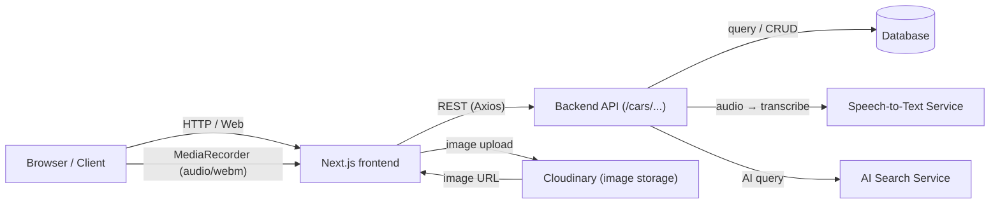
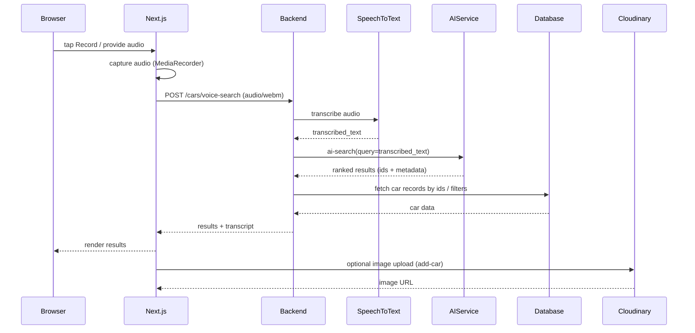

**AI-Powered Car Marketplace (speech-to-sql-frontend)**

Lightweight Next.js frontend for an AI + voice-enabled car search marketplace. Users can type or speak natural-language searches (voice → transcription → AI search), browse listings, and post new car listings (with optional image upload).

**Tech stack**
- **Framework:** Next.js (app router)
- **UI:** Tailwind CSS, Radix UI components, shadcn UI primitives
- **Language:** TypeScript + React 19
- **HTTP:** Axios-based client for backend API

## Architecture

**System diagram**



**Voice & search flow**




## Quickstart

Prerequisites: Node.js (recommend v18+ or latest LTS) and `pnpm` (recommended, project contains `pnpm-lock.yaml`).

Install dependencies and run the development server:

```bash
pnpm install
pnpm dev
```

Build for production:

```bash
pnpm build
pnpm start
```

Lint the repo:

```bash
pnpm lint
```

Open http://localhost:3000 in your browser.

## Runtime configuration
- API base URL: the frontend expects a backend API. Configure `NEXT_PUBLIC_API_URL` to point to your API. If unset, the client defaults to http://127.0.0.1:8000. See [src/lib/api/client.ts](src/lib/api/client.ts#L1).
- Image uploads: images are uploaded to Cloudinary using `src/lib/uploadToCloudinary.ts` which currently uses the cloud name `dw9dabcfw` and preset `our_space` (change as needed).

## Key features & endpoints
- Voice search: records audio in-browser and posts to `/cars/voice-search` (see [src/app/dashboard/page.tsx](src/app/dashboard/page.tsx#L1) and [src/lib/api/cars.ts](src/lib/api/cars.ts#L1)).
- AI semantic search: text queries hit `/cars/ai-search` and the UI displays `AI matched` results.
- Listing CRUD: frontend calls `/cars/` endpoints to list, add, edit, and delete car listings.
- Authentication: login/register endpoints `/login` and `/register` are used; tokens are stored in `localStorage` and attached to requests by `src/lib/api/client.ts`.

## Project structure (high level)
- [src/app](src/app#L1) — Next.js pages and routes (dashboard, browse, add-car, etc.)
- [src/components](src/components#L1) — UI components and primitives
- [src/lib](src/lib#L1) — API clients, auth context, utilities, and upload helper

